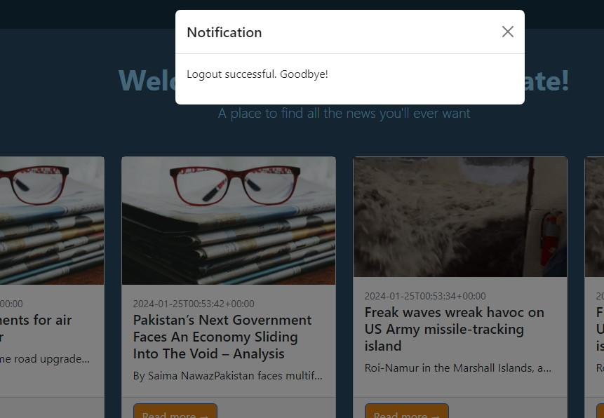
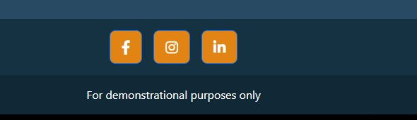
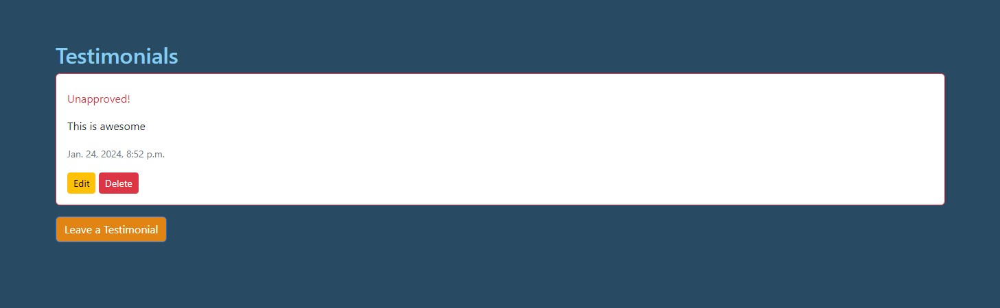
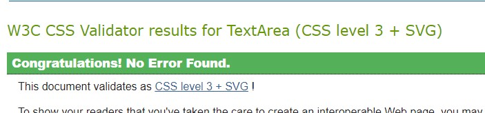

# Reds News Aggregate

"Reds News Aggregate" is a platform designed to bring together the latest news and updates related to the world of reds. This could include news about sports teams, cultural events, or any topic associated with the color red.


The live link for "Reds News Aggregate" can be found [HERE](https://reds-news-aggregate.example.com/)

## Table of Contents
+ [Purpose](#purpose "Purpose")
+ [Audience](#audience "Audience")
+ [Features](#features "Features")
  + [Latest News Feed](#latest-news-feed "Latest News Feed")
  + [Topic Filters](#topic-filters "Topic Filters")
+ [Design](#design "Design")
  + [Color Scheme](#color-scheme "Color Scheme")
  + [Typography](#typography "Typography")
+ [Future Goals](#future-goals "Future Goals")
  + [User Profiles](#user-profiles "User Profiles")
  + [Community Interaction](#community-interaction "Community Interaction")

## Purpose:
"Reds News Aggregate" aims to provide a centralized platform for enthusiasts and fans to stay updated on various news. Whether it's sports, events, or cultural highlights, this platform serves as a one-stop destination for all things red.

## Site Goal:
To give a chance for users to read any type of news they'd like and interact with each other about it as well. 

## Audience:
For everyoen who wishes to browse the news to their hearts content. There really isn't an idea user age except for perhaps children.

## Communication:
With a clean, easy to follow layout, the users are guided through the features of the website with an ease of navigation.

## Features:

### Latest News Feed
Users can access a constantly updating feed of the latest news related to the color red. This includes articles, announcements, and highlights from various sources.

## Design

### Color Scheme
The color scheme is based on the blog template found [here](https://startbootstrap.com/template/blog-home) and the color template chosen by me 

##### Home Page: 


##### Blog Page:


- Those were mostly done in Wordpress to start with and later in Gimp to edit. 


### Typography

- All fonts were obtained by the Bootstrap theme linked above. they are free to use under the MIT license.

## Features

### Existing Features:

#### Home Page:


#### Navigation Bar:

##### Desktop:


##### Mobile:


#### Testimonials Page:


#### Bug report page Page:


#### Log in, Log out & Sign up:

##### Login:


##### Logout:



##### Register:


#### Social Links:



### Who gives a C.R.U.D:
- The buttons to invite you to submit,edit, read and delete a new testimonial will be found on the **"testimonials"** page.
- they are only visible to users who are signed in.


## User Stories

- The user story public project board can be found [here](https://github.com/users/Redsskull/projects/3)

## Future Goals
- email verification on registration
- tidy up the user model to use username rather than email as username

### User Profiles
- In the future, "Reds News Aggregate" plans to introduce user profiles, allowing enthusiasts to personalize their experience, save favorite articles, and interact with the community.

## Testing

### Validator Testing
| **TEST** | **ACTION** | **EXPECTATION** | **RESULT** |
| ----------------------------- | ----------------------- | --------------------------- | ---------- |
| newsagg - settings.py | PEP8 validator |  | ✅ |
| newsagg - urls.py | PEP8 validator | No issues found | ✅ |
| news app - models.py | PEP8 validator | No issues found | ✅ |
| news app- views.py | PEP8 validator | No issues found | ✅ |
| news app - urls.py | PEP8 validator | No issues found | ✅ |
| news app - admin.py | PEP8 validator | No issues found | ✅ |
| testimonials app - forms.py | PEP8 validator | No issues found | ✅ |
| testimonials app - models.py | PEP8 validator | No issues found | ✅ |
| testimonials app - views.py | PEP8 validator | No issues found | ✅ |
| testimonials app - urls.py | PEP8 validator | No issues found | ✅ |
| testimonials app - admin.py | PEP8 validator | No issues found | ✅ |
| bug_report app - admin.py | PEP8 validator | No issues found | ✅ |
| bug_report app - models.py | PEP8 validator | No issues found | ✅ |
| bug_report app - forms.py | PEP8 validator | No issues found | ✅ |
| bug_report app - views.py | PEP8 validator | No issues found | ✅ |
| bug_report app - urls.py | PEP8 validator | No issues found | ✅ |
| accounts app - models.py | PEP8 validator | No issues found | ✅ |
| accounts app - views.py | PEP8 validator | No issues found | ✅ |
| accounts app - forms.py | PEP8 validator | No issues found | ✅ |
| accounts app - urls.py | PEP8 validator | No issues found | ✅ |
| all automated test files | PEP8 validator | No issues found | ✅ |
| style.css | [W3C - Jigsaw](https://jigsaw.w3.org/css-validator/) validator |  | ✅ |
| Home page - html | [W3C](https://validator.w3.org/) validator - source code | No issues found | ✅ |
| Testimonials page - html | W3C validator - source code | No issues found | ✅ |
| Report a bug page - html | W3C validator - source code | No issues found | ✅ |
| Sign-in page - html | W3C validator - source code | No issues found | ✅ |
| Home page - html | lighthouse | [Acceptable scores](images/lighthouse.jpg) | ✅ |
| Testimonials page - html | lighthouse | Acceptable scores | ✅ |
| Report a bug page - html | lighthouse | Acceptable scores | ✅ |
| Sign-in page - html | lighthouse | Acceptable scores | ✅ |
| Brave browser | Launch site | Site opens without issue | ✅ |
| scripts.js |[jshint](https://jshint.com/)|  | ✅ |

- Javascript testing does not recognize the bootstrap variable, but it is the syntax required to initilize the modals I am using. 

### Responsiveness testing

| **TEST**                      | **ACTION**              | **EXPECTATION**             | **RESULT** |
| ----------------------------- | ----------------------- | --------------------------- | ---------- |
| Home page - responsiveness    | Size site down to 320px | all elements stay on screen | ✅         |
| Home page - responsiveness    | Size site up to 1920ox  | all elements stay on screen | ✅         |
| Testimonial page - responsiveness   | Size site down to 320px | all elements stay on screen | ✅         |
| Testimonial page - responsiveness   | Size site up to 1920ox  | all elements stay on screen | ✅         |
| Report a bug page - responsiveness  | Size site down to 320px | all elements stay on screen | ✅         |
| Report a bug page - responsiveness  | Size site up to 1920ox  | all elements stay on screen | ✅         |
| Sign-in page - responsiveness | Size site down to 320px | all elements stay on screen | ✅         |
| Sign-in page - responsiveness | Size site up to 1920ox  | all elements stay on screen | ✅         |

### C.R.U.D. testing

| **TEST**          | **ACTION**             | **EXPECTATION**          | **RESULT** |
| ----------------- | ---------------------- | ------------------------ | ---------- |
| Testimonial - Create     | Add new instance to DB | Instance created         | ✅         |
| Testimonial - Read       | Retrieve all instances | Instances visible in UI  | ✅         |
| Testimonial- Update     | Modify an instance     | Mods saved & visible     | ✅         |
| Testimonial - Delete     | Delete an instance     | Instance removed from UI | ✅         |
### FEATURES

| **TEST**                      | **ACTION**             | **EXPECTATION**                                           | **RESULT** |
| ----------------------------- | ---------------------- | --------------------------------------------------------- | ---------- |
| Navigation bar                | Click on nav link      | user routed to correct page                               | ✅         |
| Footer links                  | Click on footer links  | user routed to new browser tab                            | ✅         |
| Edit button                   | Click edit button      | user navigated to edit screen                             | ✅         |
| Delete button                 | Click delete button    | Testimonial removed from UI                                | ✅         |
| Internal links                | Click link             | User routed to appropriate page                           | ✅         |
| Login                         | User logs in           | UI updates & user is logged in                            | ✅         |
| Sign up                       | User signs up          | new account created for the user                          | ✅         |
| Logout                        | User clicks logout     | UI updates, user is logged out, user cannot create a Testimonial or report a bug | ✅         |

### Automated testing:
- I've written and ran as many automated tests as time and knowledge let me. I've run them  

## Technologies Used
### Main Languages Used
- HTML5
- CSS3
- Javascript
- Python
- Django
- Bootstrap
- SQL - Postgres


### Frameworks, Libraries & Programs Used
- Bootstrap theme fonts were used. custom vars which came with the theme are located in the styles.css
- Font Awesome - to add icons to the social links in the footer element.
- Vscode was used to write all the code present in the repository. 
- GitHub was used for version control
- Wordpress was used to get an intial idea of how I'd like the site to look.
- Am I Responsive? - to ensure the project looked good across all devices.
- Favicon was provided with the Bootstrap theme
- Gimp - for photo editing
- Django
- Bootstrap

### Installed Packages:
- 'django<4' gunicorn
- dj_database_url psycopg
- 'crispy_forms',
-'crispy_bootstrap5'

## Deployment
The site was deployed to Heroku. The steps to deploy are as follows:
- Install Django & Gunicorn:
```pip3 install 'django<4' gunicorn```
- Creating the requirements.txt file with the following command:
```pip3 freeze --local > requirements.txt```
- navigated to [Heroku](www.heroku.com) & created a new app called news-agg.
- added the Heroku Postgres database to the config vars.
- added SECRET_KEY config var to Heroku
- added Heroku to the ALLOWED_HOSTS in settings.py
- created the Procfile
- pushed the project to Github
- connected my github account to Heroku through the Deploy tab
- connected my github project repository, and then clicked on the "Deploy" button

## Credits

### Content
- [Martina Terlevic](https://github.com/SephTheOverwitch): I didn't know what CRUD functionality to put in this idea of mine. In fact, I was not very creative at all. She helped me come up with idead when I needed them.
- “I think therefore I blog” walkthrough: without this walkthorugh I wouldn't have known a thing. The first steps when I was starting this app were directly taken from them, such as how to make migrations, even start a project. 
- [Sean](https://www.linkedin.com/in/seanmeadedev/): a Code Institute alumni who I always enjoy talking tech with. When I end of my knowledge in JavaScript, he helped me learn more. The CRUD modal in the Testimonial app would not be possible without him.
- [startbootstrap](https://startbootstrap.com/) their blog template and CSS was used as a base for the design of this project.
- Much of the code written here was done through a lot of research, much trial and error and hours staring at a traceback. Stackoverflow, reddit/learnprogramming and reddit/Django were all used to help write the code. 


### Media
- All photography displayed in the Artists gallery was created by me.
- The drawings were provided by my friend, [Eleni Sarri](https://www.instagram.com/elenibydesign/), with her permission.

#### Pexels:
- Default news post image, by: [Suzy Hazelwood](https://www.pexels.com/photo/red-framed-eyeglasses-on-newspapers-3886870/)