# Reds News Aggregate

"Reds News Aggregate" is a platform designed to bring together the latest news and updates related to the world of reds. This could include news about sports teams, cultural events, or any topic associated with the color red.

[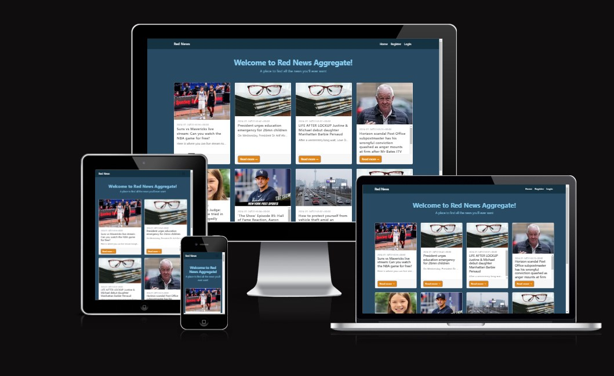]

The live link for "Reds News Aggregate" can be found [HERE](https://reds-news-aggregate.example.com/)

## Table of Contents
+ [Purpose](#purpose "Purpose")
+ [Audience](#audience "Audience")
+ [Features](#features "Features")
  + [Latest News Feed](#latest-news-feed "Latest News Feed")
  + [Topic Filters](#topic-filters "Topic Filters")
+ [Design](#design "Design")
  + [Color Scheme](#color-scheme "Color Scheme")
  + [Typography](#typography "Typography")
+ [Future Goals](#future-goals "Future Goals")
  + [User Profiles](#user-profiles "User Profiles")
  + [Community Interaction](#community-interaction "Community Interaction")

## Purpose:
"Reds News Aggregate" aims to provide a centralized platform for enthusiasts and fans to stay updated on various news. Whether it's sports, events, or cultural highlights, this platform serves as a one-stop destination for all things red.

## Site Goal:
To give a chance for users to read any type of news they'd like and interact with each other about it as well. 

## Audience:
For everyoen who wishes to browse the news to their hearts content. There really isn't an idea user age except for perhaps children.

## Communication:
With a clean, easy to follow layout, the users are guided through the features of the website with an ease of navigation.

## Features:

### Latest News Feed
Users can access a constantly updating feed of the latest news related to the color red. This includes articles, announcements, and highlights from various sources.

## Design

### Color Scheme
The color scheme is based on the blog template found [here](https://startbootstrap.com/template/blog-home) and the color template chosen by me [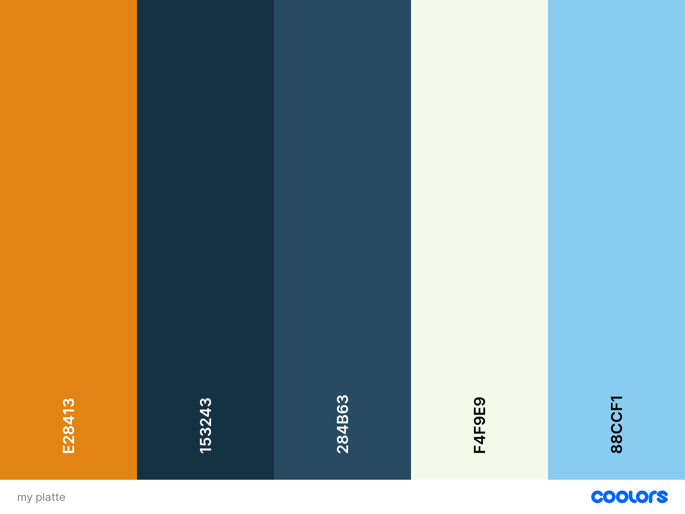]

##### Home Page: 

[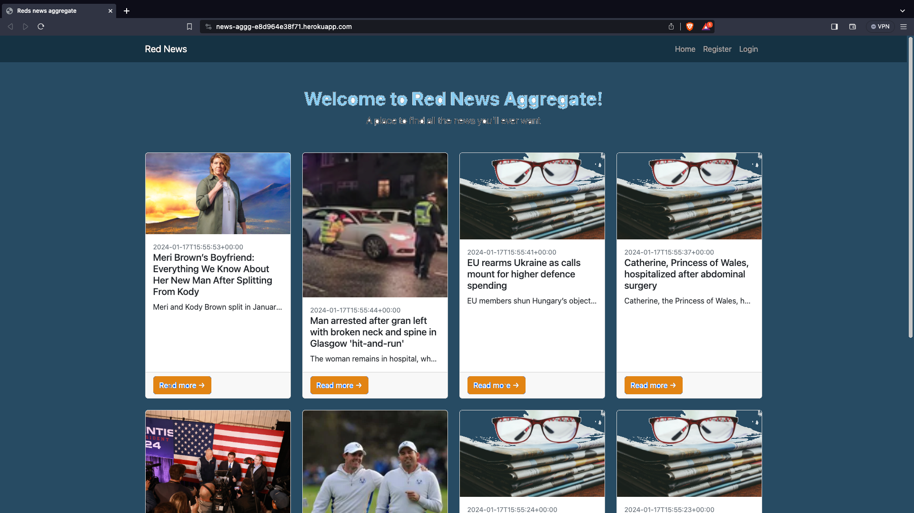]

##### Blog Page:

[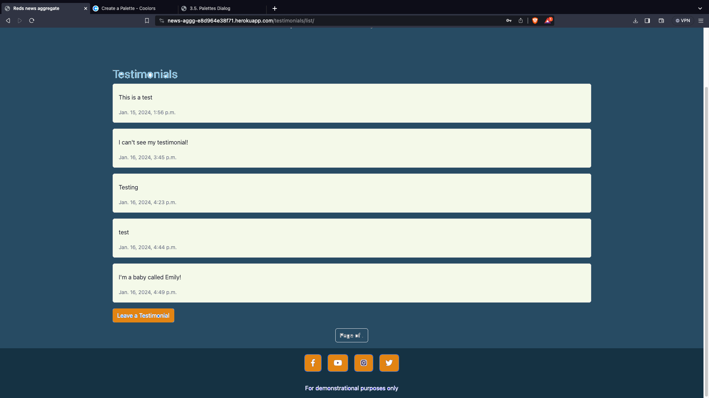]

- Those were mostly done in Wordpress to start with and later in Gimp to edit. 

### Typography

- All fonts were obtained by the Bootstrap theme linked above. they are free to use under the MIT license.
## Features

### Existing Features:

#### Home Page:

[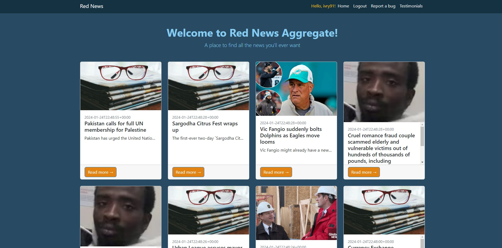]

#### Navigation Bar:

##### Desktop:

[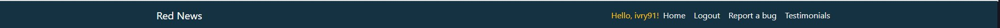]

##### Mobile:

[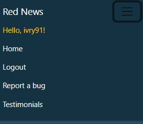]

#### Testimonials Page:

[]

#### Bug report page Page:

[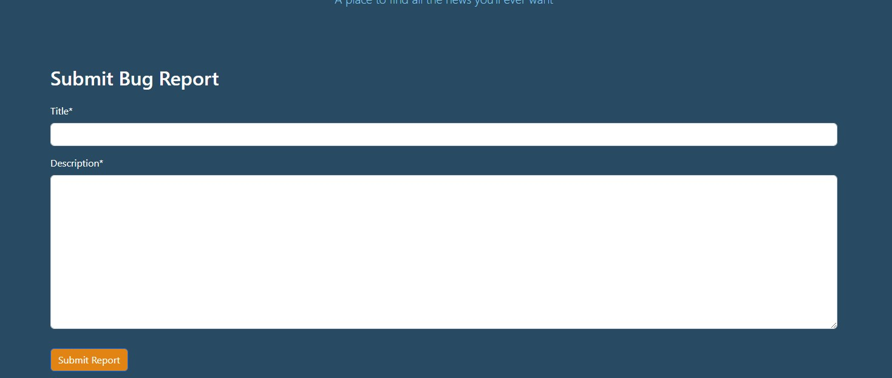]

#### Log in, Log out & Sign up:

##### Login:

[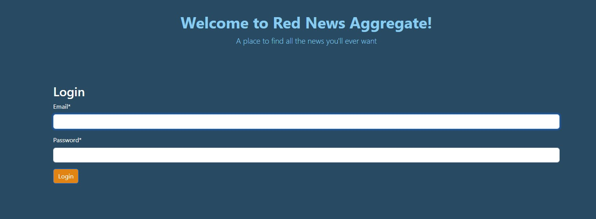]

##### Logout:

[]

##### Register:

[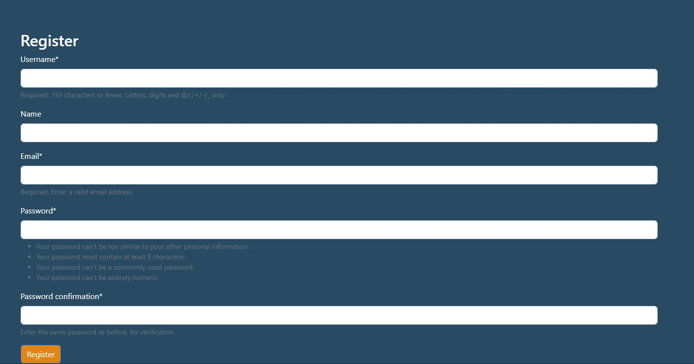]

#### Social Links:

[]

### Who gives a C.R.U.D:
- The buttons to invite you to submit,edit, read and delete a new testimonial will be found on the **"testimonials"** page.
- they are only visible to users who are signed in.

## User Stories

- The user story public project board can be found [here](https://github.com/users/Redsskull/projects/3)

## Future Goals
- email verification on registration
- tidy up the user model to use username rather than email as username

### User Profiles
- In the future, "Reds News Aggregate" plans to introduce user profiles, allowing enthusiasts to personalize their experience, save favorite articles, and interact with the community.

## Testing

### Validator Testing
| **TEST** | **ACTION** | **EXPECTATION** | **RESULT** |
| ----------------------------- | ----------------------- | --------------------------- | ---------- |
| newsagg - settings.py | PEP8 validator | [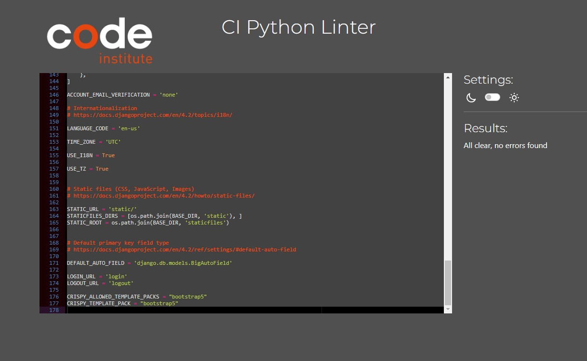] | ✅ |
| newsagg - urls.py | PEP8 validator | No issues found | ✅ |
| news app - models.py | PEP8 validator | No issues found | ✅ |
| news app- views.py | PEP8 validator | No issues found | ✅ |
| news app - urls.py | PEP8 validator | No issues found | ✅ |
| news app - admin.py | PEP8 validator | No issues found | ✅ |
| artprint app - forms.py | PEP8 validator | No issues found | ✅ |
| artprint app - models.py | PEP8 validator | No issues found | ✅ |
| artprint app - views.py | PEP8 validator | No issues found | ✅ |
| artprint app - urls.py | PEP8 validator | No issues found | ✅ |
| artprint app - admin.py | PEP8 validator | No issues found | ✅ |
| style.css | [W3C - Jigsaw](https://jigsaw.w3.org/css-validator/) validator | [No issues found](static/images-readme/readme-w3c-css.png) | ✅ |
| Home page - html | [W3C](https://validator.w3.org/) validator - source code | No issues found | ✅ |
| About page - html | W3C validator - source code | No issues found | ✅ |
| Blog page - html | W3C validator - source code | No issues found | ✅ |
| Prints page - html | W3C validator - source code | No issues found | ✅ |
| Sign-in page - html | W3C validator - source code | No issues found | ✅ |
| Home page - html | lighthouse | [Acceptable scores](static/images-readme/readme-lighthouse.png) | ✅ |
| About page - html | lighthouse | Acceptable scores | ✅ |
| Blog page - html | lighthouse | Acceptable scores | ✅ |
| Prints page - html | lighthouse | Acceptable scores | ✅ |
| Sign-in page - html | lighthouse | Acceptable scores | ✅ |
| Brave browser | Launch site | Site opens without issue | ✅ |

### Responsiveness testing

| **TEST**                      | **ACTION**              | **EXPECTATION**             | **RESULT** |
| ----------------------------- | ----------------------- | --------------------------- | ---------- |
| Home page - responsiveness    | Size site down to 320px | all elements stay on screen | ✅         |
| Home page - responsiveness    | Size site up to 1920ox  | all elements stay on screen | ✅         |
| About page - responsiveness   | Size site down to 320px | all elements stay on screen | ✅         |
| About page - responsiveness   | Size site up to 1920ox  | all elements stay on screen | ✅         |
| Prints page - responsiveness  | Size site down to 320px | all elements stay on screen | ✅         |
| Prints page - responsiveness  | Size site up to 1920ox  | all elements stay on screen | ✅         |
| Blog page - responsiveness    | Size site down to 320px | all elements stay on screen | ✅         |
| Blog page - responsiveness    | Size site up to 1920ox  | all elements stay on screen | ✅         |
| Sign-in page - responsiveness | Size site down to 320px | all elements stay on screen | ✅         |
| Sign-in page - responsiveness | Size site up to 1920ox  | all elements stay on screen | ✅         |

### C.R.U.D. testing

| **TEST**          | **ACTION**             | **EXPECTATION**          | **RESULT** |
| ----------------- | ---------------------- | ------------------------ | ---------- |
| Blog - Create     | Add new instance to DB | Instance created         | ✅         |
| Blog - Read       | Retrieve all instances | Instances visible in UI  | ✅         |
| Blog - Update     | Modify an instance     | Mods saved & visible     | ✅         |
| Blog - Delete     | Delete an instance     | Instance removed from UI | ✅         |
| Comments - Create | Add new instance to DB | Instance created         | ✅         |
| Comments - Read   | Retrieve all instances | Instances visible in UI  | ✅         |
| Artprint - Create | Add new instance to DB | Instance created         | ✅         |
| Artprint - Read   | Retrieve all instances | Instances visible in UI  | ✅         |
| Artprint - Update | Modify an instance     | Mods saved & visible     | ✅         |
| Artprint - Delete | Delete an instance     | Instance removed from UI | ✅         |
| Like - Create | Add new instance to DB | Instance created         | ✅         |
| Like - Delete | Delete an instance     | Instance removed from UI | ✅         |

### FEATURES

| **TEST**                      | **ACTION**             | **EXPECTATION**                                           | **RESULT** |
| ----------------------------- | ---------------------- | --------------------------------------------------------- | ---------- |
| Navigation bar                | Click on nav link      | user routed to correct page                               | ✅         |
| Footer links                  | Click on footer links  | user routed to new browser tab                            | ✅         |
| Like button                   | Click "like"           | Post liked/unliked accordingly                            | ✅         |
| Edit button                   | Click edit button      | user navigated to edit screen                             | ✅         |
| Delete button                 | Click delete button    | print/blog removed from UI                                | ✅         |
| Internal links                | Click link             | User routed to appropriate page                           | ✅         |
| Login                         | User logs in           | UI updates & user is logged in                            | ✅         |
| Sign up                       | User signs up          | new account created for the user                          | ✅         |
| Logout                        | User clicks logout     | UI updates, user is logged out, user cannot create a post | ✅         |
